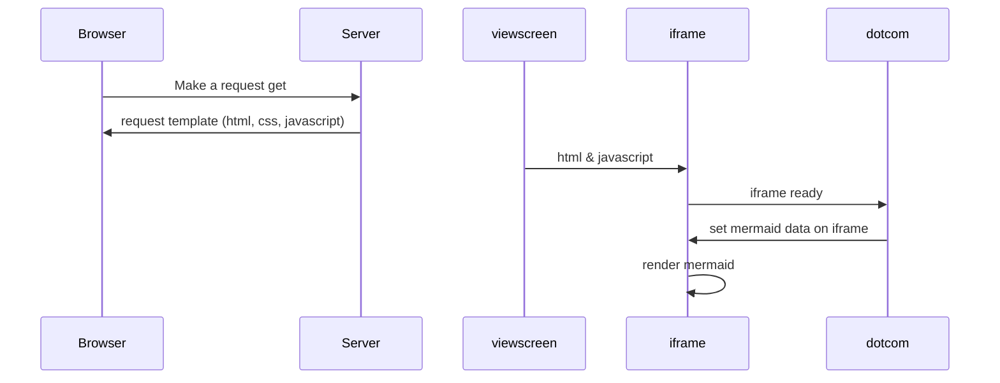

# SequenceDiagram

```mermaid
sequenceDiagram
    participant Browser
    participant Server
    Browser->>Server: Make a request get
    Server->>Browser: request template (html, css, javascript)
    viewscreen->>iframe: html & javascript
    iframe->>dotcom: iframe ready
    dotcom->>iframe: set mermaid data on iframe
    iframe->>iframe: render mermaid
```
