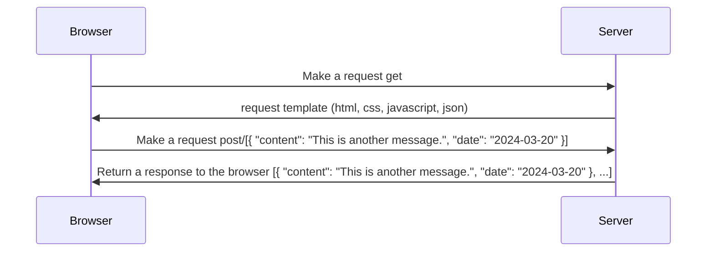

# SequenceDiagram

```mermaid
sequenceDiagram
    participant Browser
    participant Server
    Browser->>Server: Make a request get
    Server->>Browser: request template (html, css, javascript, json)
    Browser->>Server: Make a request post/[{ "content": "This is another message.", "date": "2024-03-20" }]
    Server->>Browser: Return a response to the browser [{ "content": "This is another message.", "date": "2024-03-20" }, ...]
```
