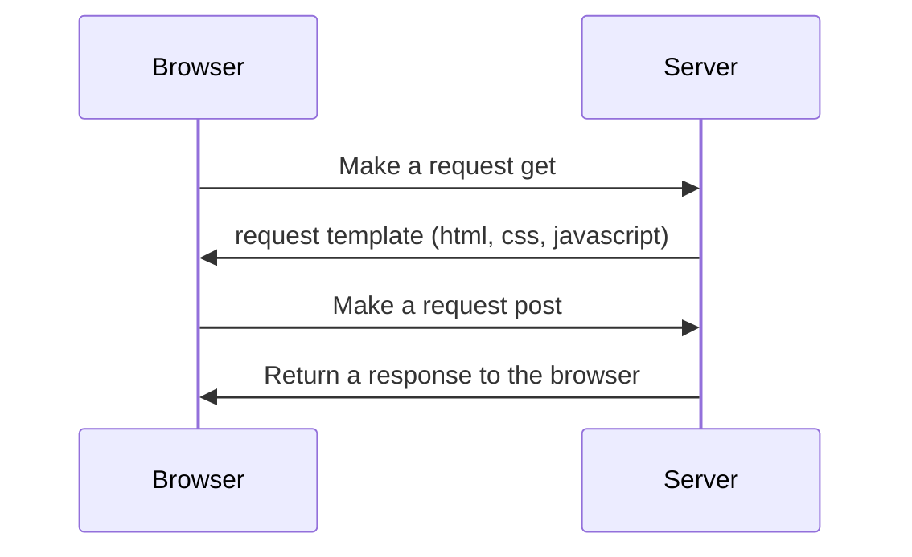

# SequenceDiagram

```mermaid
sequenceDiagram
    participant Browser
    participant Server
    Browser->>Server: Make a request get
    Server->>Browser: request template (html, css, javascript)
    Browser->>Server: Make a request post
    Server->>Browser: Return a response to the browser
```
